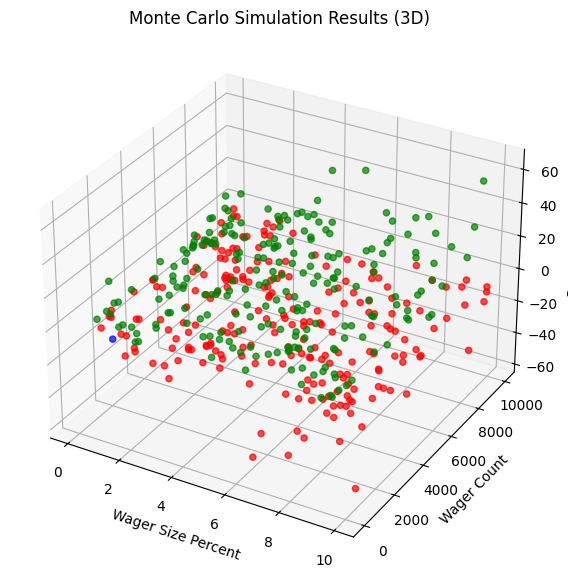

# 🎲 Monte Carlo Betting Strategies & Risk of Ruin

This project uses Monte Carlo simulation to stress-test classic betting strategies and quantify their risk of ruin. I started with a simple question: if the odds are only slightly against you, how badly does it end? From there I simulated thousands of betting sessions across multiple strategies, measured bust rates, profit rates and overall returns, and then used the simulation itself to search for optimal strategy parameters.

What began as a dice game turned into a study of position sizing, randomness and survival, which are the same dynamics that drive capital management and drawdown risk in real portfolios.

<p align="center"></p>

**Key results**

- Over 1,000 bets and 100 sessions, 0% of flat bettors went bust versus 86% of martingale bettors
- The optimal loss multiplier was around 1.7, found by simulation against benchmarks of a 31.235% bust rate and 68.785% profit rate
- d'Alembert only produces steady profit at wager sizes near one millionth of capital, making it impractical: there is no reliable way to beat the odds

## 📦 Technologies

- `Python`
- `Matplotlib`
- `CSV logging`
- `Jupyter Notebook`

## ⚙️ What I Built

**The simple bettor**

I first created a simple bettor with a 49 percent chance of winning and a 51 percent chance of losing, and ran the bets thousands of times using Monte Carlo simulation. The results showed that after a large number of sessions almost everyone lost money, even though the difference in odds was only 1 percent.

**The martingale bettor**

I then tested a martingale (doubling) strategy and compared it against the simple bettor on survival rates. Over 1,000 bets and 100 sessions, none of the simple bettors went bust, whereas 86 percent of martingale bettors did. When sessions increased to 1,000, some simple bettors also began to go bust. The pattern was clear: the simple bettor had a much lower bust chance but also a much lower profit chance, while the doubler showed the opposite. Which is preferable depends entirely on risk aversion, and as the number of sessions tends towards infinity, neither survives.

**Using simulation to find an optimal multiplier**

Rather than fixing the doubling multiple at 2, I introduced it as a variable. Using a sample size of 10,000, I searched for any multiple that beat the benchmark bust rate of 31.235 percent and profit rate of 68.785 percent. On average the best value came out around 1.7, with roughly 1.75 optimal for sessions of 100 wagers and around 1.65 in later tests. This was the first time I used Monte Carlo simulation not just to measure an outcome but to generate a value for a new variable.

**A stricter test of profitability**

Survival rate and profit chance alone are not enough, so I also totalled final funds across all simulated players. For 1,000 players starting with 10,000 each, total ending funds must exceed 10 million for the strategy to be genuinely promising, and ideally that result should hold across 1 million or more samples. This forced me to think about expected value across a whole population rather than cherry-picking survivors.

**The d'Alembert sweep**

Switching the odds to 50/50, I extended the analysis to the d'Alembert system and swept two variables at once: wager size and wager count. After each batch the program calculated percentage ROI and wager size as a percentage of starting funds. If ROI exceeded plus or minus 1 percent it printed a full summary, including total invested, total return, ROI, bust rate, profit rate, wager size and wager count, and saved every result to `monteCarlo.csv` for later analysis.

**Visualising the results**

Each point in the scatter plot is one simulation batch: wager size percent on the x-axis, wager count on the y-axis, coloured green for good ROI and red for poor ROI. A 3D version adds percent ROI as the third axis, turning thousands of simulations into a visible risk/return surface that shows which parameter combinations tend to perform better or worse. I also simulated the Labouchere cancellation system as a final extension.

## 📚 What I Learned

**There is no reliable way to beat the odds**

The conclusion was clear: no betting system meaningfully overcomes a negative edge. The d'Alembert strategy can produce steady, reliable profit, but only when the wager size is tiny relative to total funds, around one millionth of capital for a fraction of a percent in long-term returns. The time required makes it completely impractical. Gambling should be treated as entertainment; the moment it becomes a profit strategy, the odds are already working against you.

**Randomness shapes the outliers**

What I found most interesting was the role of pure randomness in extreme outcomes. Outliers are often viewed with admiration or discontent depending on which way they fall, with very little appreciation for the randomness that produced them. Watching identical strategies generate wildly different fates across simulated players made that lesson concrete.

**Simulation as a general tool**

The same method extends well beyond betting: searching for variables that produce results above or below a threshold, or within a range, is the same logic used in estimating pi, pricing models and risk analysis. Building the simulator gradually, testing it against several systems, taught me as much about structuring an experiment as about the strategies themselves.

## 💬 How can it be improved?

- Increase sample sizes towards the 1 million plus runs needed for tighter confidence intervals
- Add a Kelly criterion bettor as a theoretically optimal benchmark
- Model table limits and maximum bet constraints, which break martingale systems in practice
- Track full drawdown paths per session rather than only terminal outcomes
- Refactor the strategies into a shared simulation framework with common parameters

## 🔌 Running the Project

1. Clone the repository to your local machine
2. Install matplotlib: `pip install matplotlib`
3. Open the notebook in Jupyter:

```bash
jupyter notebook betting_strategies_simulation.ipynb
```

The d'Alembert sweep appends results to `monteCarlo.csv`, and the plotting cells read from the same file.

## 🙏 Acknowledgments

This project was developed with guidance from the [Monte Carlo simulation tutorial series](https://pythonprogramming.net/monte-carlo-simulator-python/) by [sentdex](https://github.com/Sentdex). All experimentation, parameter searches and the write-up are my own.
